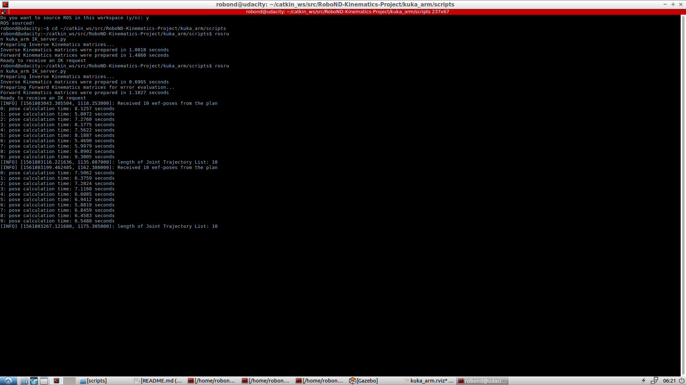
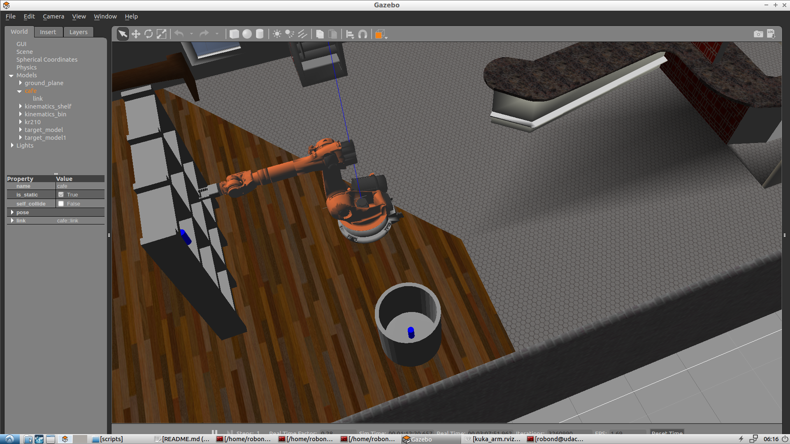

# RoboND_Robotic-Arm-Pick-Place

*This project covers the **forward and inverse kinematics** for **a six DOF Kuka KR210 robot arm** for picking and placing target objects from shelf to the basket.*

**ROS, Gazebo, RViz, Moveit!** are also implemented in this project and **Python** is choosed to write most of the cod

This is a `README` that includes all the key points and how I addressed each one.

**Steps to complete the project:**  

1. Set up your ROS Workspace.
2. Download or clone the [project repository](https://github.com/udacity/RoboND-Kinematics-Project) into the ***src*** directory of your ROS Workspace.  
3. Experiment with the forward_kinematics environment and get familiar with the robot.
4. Launch in [demo mode](https://classroom.udacity.com/nanodegrees/nd209/parts/7b2fd2d7-e181-401e-977a-6158c77bf816/modules/8855de3f-2897-46c3-a805-628b5ecf045b/lessons/91d017b1-4493-4522-ad52-04a74a01094c/concepts/ae64bb91-e8c4-44c9-adbe-798e8f688193).
5. Perform Kinematic Analysis for the robot following the [project rubric](https://review.udacity.com/#!/rubrics/972/view).
6. Fill in the `IK_server.py` with your Inverse Kinematics code. 

# 1 Kinematic Analysis
## 1.1 Run the forward_kinematics demo and evaluate the kr210.urdf.xacro file to perform kinematic analysis of Kuka KR210 robot and derive its DH parameters.
Here is the RViz TF Display **with** Robot Model:

Here is the RViz TF Display **without** Robot Model:

They provides very clear schematics of **URDF** coordinate for each joints. The TF information in left Display section will also help to come up with the modified DH parameters and build the modified DH Table using the convention described in **John J Craig**'s book.

### DH reference frames of each joint are shown below:

### The according DH table calculated using the URDF files is:
Links | alpha(i-1) | a(i-1) | d(i-1) | theta(i)
--- | --- | --- | --- | ---
0->1 | 0 | 0 | 0.75 | 
1->2 | - pi/2 | 0.35 | 0 | -pi/2 + theta2
2->3 | 0 | 1.25 | 0 | 
3->4 | - pi/2 | -0.054 | 1.5 | 
4->5 | pi/2 | 0 | 0 | 
5->6 | - pi/2 | 0 | 0 | 
6->G | 0 | 0 | 0.303 | 0

## 1.2 Using the DH parameter table derived earlier, create individual transformation matrices about each joint. In addition, also generate a generalized homogeneous transform between base link and gripper link using only end-effector(gripper) pose.

The individual transformation matrix for modified DHparam is:

By substitude the DH table in to the matrix, we can get **T0_G = T0_1 * T1_2 * T2_3 * T3_4 * T4_5 * T5_6 * T6_G**

However, the orientation of DH and URDF gripper frames is different as shown below:

So, an **T_corr** is needed to applied to **T0_G** to get the final **T_total** for forward kinematics.

### T_total = T_total = T0_G * T_corr = T0_G * T_R_z(pi) * T_R_y(-pi/2), where T_R_z(pi) is the according transformation matrix for rotating about z axis for 90°, here a intrinsic rotation principle is applied. 

The T_total here can provide us with the total transformation to a gripper position in URDF coordinates. This transformation can be used directly for solving **Forward Kinematics** problem in which the θ1, θ2, θ3, θ4, θ5, θ6 and base link position are known and the gripper position is requrired.

## 1.3 Decouple Inverse Kinematics problem into Inverse Position Kinematics and inverse Orientation Kinematics; doing so derive the equations to calculate all individual joint angles.

For **Inverse Kinematics**, where the gripper position is known, θ1, θ2, θ3, θ4, θ5, θ6 are required, this total transformation can be represented the gripper pose which is defined by **px, py, pz, roll, pitch and yaw**.

Let's start with the **R_rpy = R_z(yaw) * R_y(pitch) * R_x(roll)**

After getting the R_rpy, the position of the wrist center(WC) can be calculated an offset d6 along x axis in URDF coordinate:
### WC = Matrix([[px], [py], [pz]]) - d6 * (R_rpy * Matrix([[1], [0], [0]]))

**θ1, θ2 and θ3** can be derived using the position of the wrist center(WC). For more detailed about the trigonometric euqations, please refered to `IK_server.py`

Using the calculated θ1, θ2 and θ3, we can have R0_3, and R3_6 can be obtained by:  
### R0_3 * R3_6 * R6_G * R_corr = R_rpy => R3_6 = R0_3T * R_rpy * R_corrT

Once we have R3_6, **θ4, θ5, θ6** can be calculated. atan2 gives us the range (−180◦,180◦], but joints 4 and 6 have the range (−350◦,350◦). So some additional logic is applied for these angles. A decision about the sign of θ5 is also needed to be made. *Shortest angular distance for a joint rotation* is implemented to solve these problems. For more detailed about this process, please refered to `IK_server.py`

### So far, θ1, θ2, θ3, θ4, θ5 and θ6 are all calculated using the gripper position and Inverse Kinematics is finished. Their values are packed into the joint_trajectory_point.positions = [θ1, θ2, θ3, θ4, θ5, θ6] and the service responce has been sent as shown below:

# 2 Project Implementation
## 2.1 Fill in the `IK server.py` file with properly commented python code for calculating Inverse Kinematics based on previously performed Kinematic Analysis.

After executing the `IK_server.py`, the results are shown below, the blue target has been successfully picked from the shelf and place into the basket.

The errors in end-effector position generated by the joint angle commands are in `IK_FK_errors.csv`.
