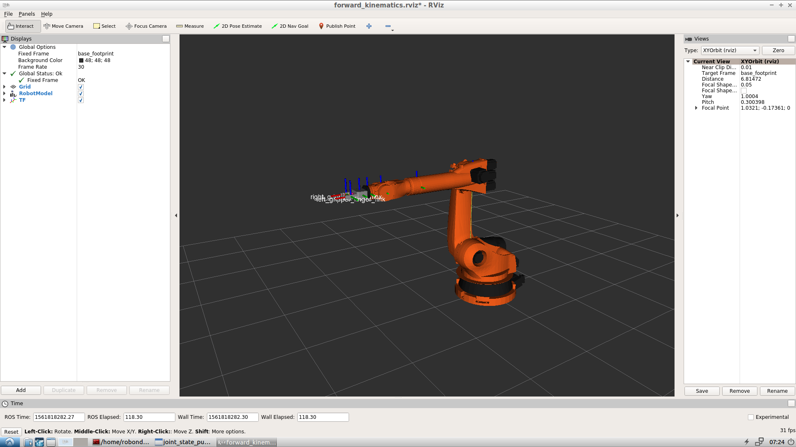
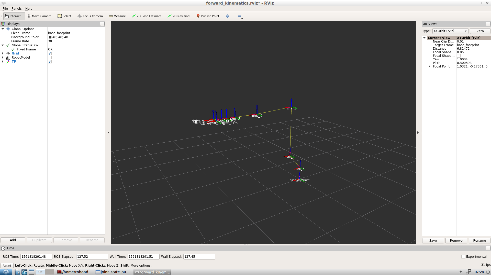
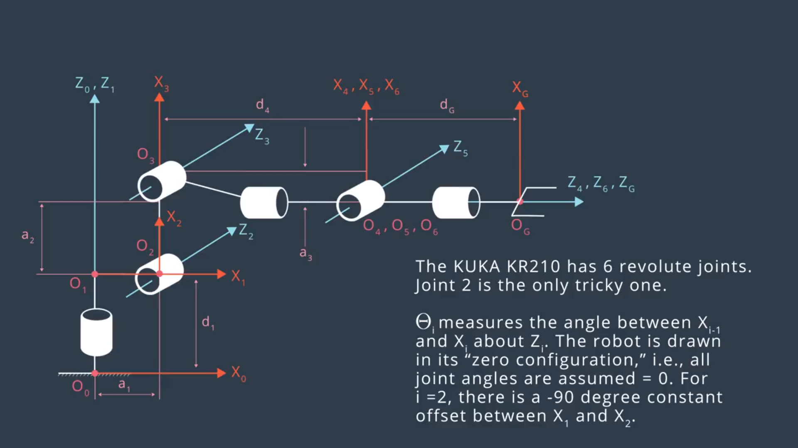

# RoboND_Robotic-Arm-Pick-Place

This project covers the forward and inverse kinematics for a six DOF Kuka KR210 robot arm for picking and placing target objects from shelf to the basket. \
ROS, Gazebo, RViz, Moveit! are also implemented in this project.

This is a README that includes all the key points and how I addressed each one.

## 1 Kinematic Analysis
### 1.1 Run the forward_kinematics demo and evaluate the kr210.urdf.xacro file to perform kinematic analysis of Kuka KR210 robot and derive its DH parameters.
Here is the RViz TF Display with Robot Model:

Here is the RViz TF Display without Robot Model:

They provides very clear schematics of URDF coordinate for each joints. The TF information in left Display section will also help to come up with the modified DH parameters and build the modified DH Table using the convention described in John J Craig's book.

#### DH reference frames of each joint are shown below:

#### The according DH table calculated using the URDF files is:
Links | alpha(i-1) | a(i-1) | d(i-1) | theta(i)
--- | --- | --- | --- | ---
0->1 | 0 | 0 | 0.75 | 
1->2 | - pi/2 | 0.35 | 0 | -pi/2 + theta2
2->3 | 0 | 1.25 | 0 | 
3->4 | - pi/2 | -0.054 | 1.5 | 
4->5 | pi/2 | 0 | 0 | 
5->6 | - pi/2 | 0 | 0 | 
6->G | 0 | 0 | 0.303 | 0

### 1.2 Using the DH parameter table derived earlier, create individual transformation matrices about each joint. In addition, also generate a generalized homogeneous transform between base link and gripper link using only end-effector(gripper) pose.

