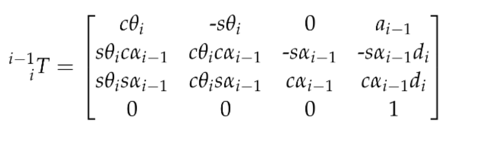
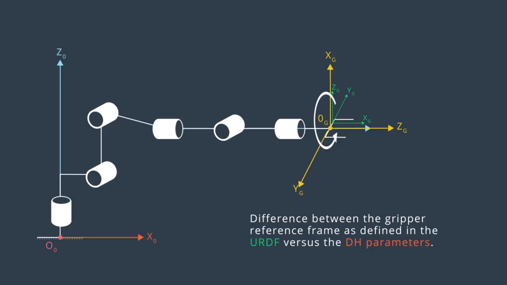

# RoboND_Robotic-Arm-Pick-Place

This project covers the **forward and inverse kinematics** for **a six DOF Kuka KR210 robot arm** for picking and placing target objects from shelf to the basket.

**ROS, Gazebo, RViz, Moveit!** are also implemented in this project and **Python** is choosed to write most of the code.

This is a README that includes all the key points and how I addressed each one.

## 1 Kinematic Analysis
### 1.1 Run the forward_kinematics demo and evaluate the kr210.urdf.xacro file to perform kinematic analysis of Kuka KR210 robot and derive its DH parameters.
Here is the RViz TF Display **with** Robot Model:

Here is the RViz TF Display **without** Robot Model:

They provides very clear schematics of **URDF** coordinate for each joints. The TF information in left Display section will also help to come up with the modified DH parameters and build the modified DH Table using the convention described in **John J Craig**'s book.

#### DH reference frames of each joint are shown below:

#### The according DH table calculated using the URDF files is:
Links | alpha(i-1) | a(i-1) | d(i-1) | theta(i)
--- | --- | --- | --- | ---
0->1 | 0 | 0 | 0.75 | 
1->2 | - pi/2 | 0.35 | 0 | -pi/2 + theta2
2->3 | 0 | 1.25 | 0 | 
3->4 | - pi/2 | -0.054 | 1.5 | 
4->5 | pi/2 | 0 | 0 | 
5->6 | - pi/2 | 0 | 0 | 
6->G | 0 | 0 | 0.303 | 0

### 1.2 Using the DH parameter table derived earlier, create individual transformation matrices about each joint. In addition, also generate a generalized homogeneous transform between base link and gripper link using only end-effector(gripper) pose.

The individual transformation matrix for modified DHparam is:

By substitude the DH table in to the matrix, we can get **T0_G = T0_1 * T1_2 * T2_3 * T3_4 * T4_5 * T5_6 * T6_G**

However, the orientation of DH and URDF gripper frames is different as shown below:

So, an **T_corr** is needed to applied to **T0_G** to get the final **T_total** for forward kinematics.

#### T_total = T_total = T0_G * T_corr = T0_G * T_R_z(pi) * T_R_y(-pi/2), where T_R_z(pi) is the according transformation matrix for rotating about z axis for 90°, here a intrinsic rotation principle is applied. 

The T_total here can provide us with the total transformation to a gripper position in URDF coordinates. This transformation can be used directly for solving **Forward Kinematics** problem in which the θ1, θ2, θ3, θ4, θ5, θ6 and base link position are known and the gripper position is requrired.

For **Inverse Kinematics**, where the gripper position is known, θ1, θ2, θ3, θ4, θ5, θ6 are required, this total transformation can be represented the gripper pose which is defined by **px, py, pz, roll, pitch and yaw**.

Let's start with the R_rpy = R_z * R_y * R_x.

where,R_z = Matrix([[ cos(yaw), -sin(yaw), 0],,R_y = Matrix([[ cos(pitch), 0,  sin(pitch)],,R_x = Matrix([[ 1,         0,          0],
	                  [ sin(yaw),  cos(yaw), 0],               [          0, 1,           0],               [ 0, cos(roll), -sin(roll)],
	                  [        0,         0, 1]])              [-sin(pitch), 0,  cos(pitch)]])              [ 0, sin(roll),  cos(roll)]])

